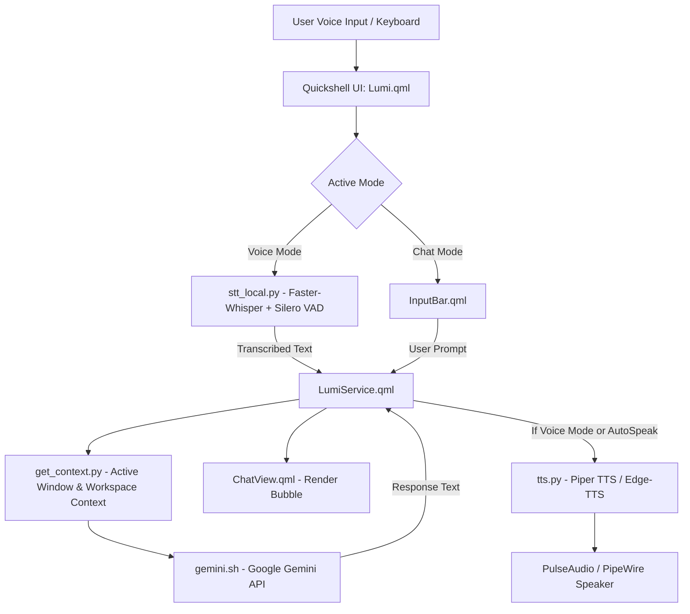

# Lumi AI v2 — Architecture & System Overview

## System Overview

Lumi AI v2 is a modern, voice-first intelligent assistant integrated into the Hyprland desktop environment via **Quickshell**. It features a dual-mode interface (Voice & Chat), continuous voice activity detection (VAD), local speech-to-text (STT), high-quality local text-to-speech (TTS), Google Gemini API integration with context injection, and an automated 2-Stage microphone calibration pipeline.

---

## Core Components

### 1. Frontend & UI Layer (`QML`)
- **`Lumi.qml`**: Main window container supporting dynamic morphing, mode toggling (Voice vs Chat), and keyboard shortcuts.
- **`LumiService.qml`**: Singleton service handling process execution, history management, state tracking, and IPC.
- **`components/VoicePanel.qml`**: Animated orb & waveform interface for hands-free voice interactions.
- **`components/ChatView.qml`**: Multi-bubble conversation history view with markdown formatting and user/assistant messages.
- **`components/InputBar.qml`**: Text input bar with voice trigger toggle.
- **`settings/LumiConfigTab.qml`**: Quickshell settings tab providing mic calibration controls, model select, and audio settings.

### 2. Backend Pipelines (`Python` & `Bash`)
- **`stt_local.py`**: High-performance local STT pipeline using **Faster-Whisper** (`tiny`) combined with **Silero VAD** ONNX for instant noise filtering and silence-based auto-cutoff.
- **`tts.py`**: Streaming Text-to-Speech engine prioritizing local **Piper TTS** (`id_ID-news_tts-medium.onnx`) with fallback to **Edge-TTS** (`id-ID-GadisNeural`).
- **`gemini.sh`**: Google Gemini API client supporting model routing (`gemini-2.5-flash`, `gemini-3.1-flash-lite`, `gemma2-9b-it`) and history context payload.
- **`get_context.py`**: Desktop context extractor gathering active window titles, current Hyprland workspace, media playback state, and system metrics.
- **`calibrate_mic.py`**: Automated 2-Stage microphone calibration pipeline measuring RMS background noise and speech energy to set optimal VAD thresholds.

---

## Data & IPC Flow

1. **Voice Input Flow**:
   - `stt_local.py` streams audio from PipeWire using `pw-record`.
   - Audio frames (32ms / 512 samples) pass through Silero VAD.
   - When speech is detected (`prob >= 0.45`), audio accumulates until `silenceDuration` (0.8s) of silence is reached.
   - Transcript is printed to `stdout` (`FINAL:...`), captured by `SplitParser` in QML.

2. **AI Processing Flow**:
   - `LumiService` invokes `get_context.py` to append current Hyprland window & system status.
   - `gemini.sh` reads history payload from `/tmp/lumi2_history.json` and posts to Google Gemini API.
   - Response is parsed and rendered in `ChatView.qml`.

3. **TTS Output Flow**:
   - If in Voice Mode or `autoSpeak` is enabled, `tts.py` cleans Markdown formatting (`**`, `#`, code blocks) and synthesizes audio via Piper TTS.
   - Audio streams to `aplay` PCM buffer.
   - Upon completion, `Lumi.qml` automatically resumes `stt_local.py` in Voice Mode for hands-free loop.

---

## IPC Signal Files (`/tmp/`)

| File Path | Description |
|---|---|
| `/tmp/lumi2_history.json` | Active conversation history payload |
| `/tmp/lumi2_context.txt` | Cached system desktop context |
| `/tmp/lumi_stt_stop` | IPC flag to interrupt local STT recording |
| `/tmp/lumi_tts_stop` | IPC flag to interrupt TTS audio playback |
| `/tmp/lumi_calib_bg.json` | Stage 1 background noise calibration stats |
