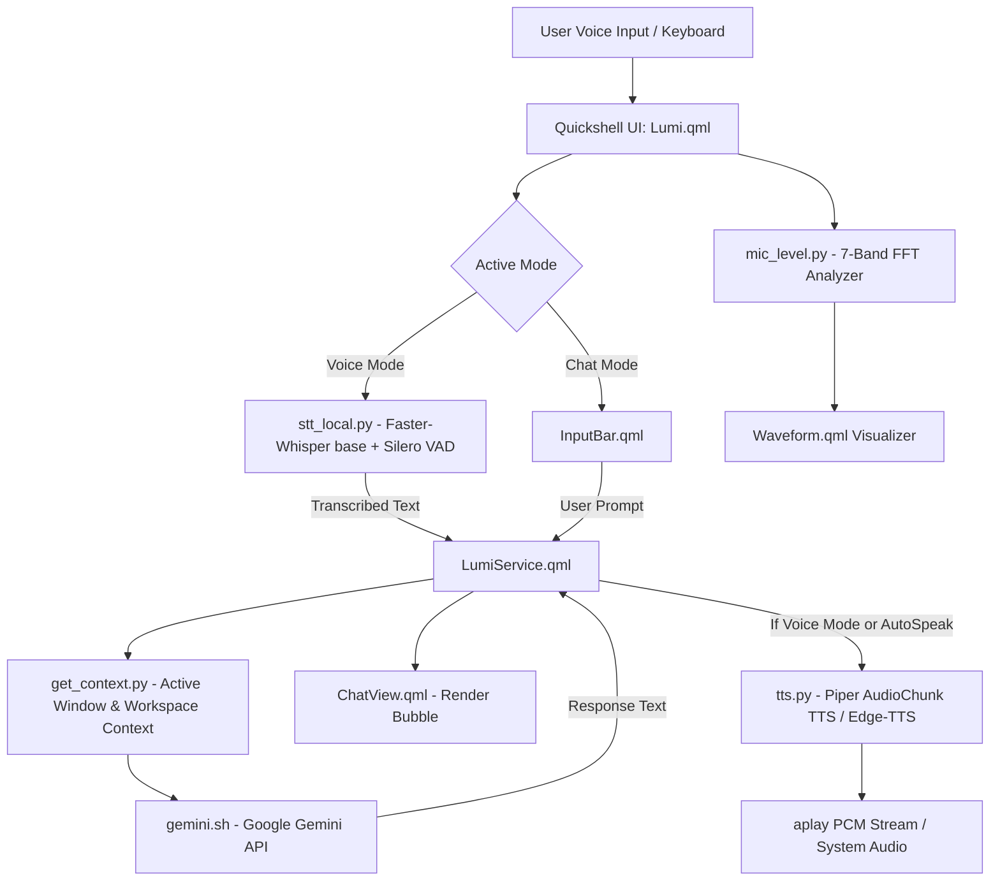

# Lumi AI v2 — Architecture & System Overview

## System Overview

Lumi AI v2 is a voice-first intelligent desktop assistant built natively for **Hyprland** using **Quickshell**. It features a dual-mode interface (Voice & Chat), continuous hybrid voice activity detection (VAD), local speech-to-text (STT), high-quality local text-to-speech (TTS) streaming via AudioChunk API, Google Gemini API integration with context injection, and an automated 2-Stage microphone calibration pipeline.

---

## Core Components

### 1. Frontend & UI Layer (`QML`)
- **`Lumi.qml`**: Main window container supporting dynamic morphing, mode toggling (Voice vs Chat), official SVG logo header, and global hotkeys.
- **`LumiService.qml`**: Singleton service handling process execution, history management, state tracking, and IPC.
- **`components/VoicePanel.qml`**: Animated voice panel with Karaoke word highlighting, status aura glow, and action buttons.
- **`components/Waveform.qml`**: 7-bar dynamic visualizer animated by live FFT data from `mic_level.py`.
- **`components/ChatView.qml`**: Multi-bubble conversation history view with markdown formatting.
- **`components/InputBar.qml`**: Text input bar with voice mode toggle.
- **`settings/LumiConfigTab.qml`**: Quickshell settings tab providing mic calibration controls, model select, and audio settings.

### 2. Backend Pipelines (`Python` & `Bash`)
- **`stt_local.py`**: Local STT pipeline using **Faster-Whisper** (`base` with fallback to `tiny`), **Silero VAD** ONNX, peak audio normalization, Indonesian language lock (`language="id"`), and prompt context injection.
- **`tts.py`**: Streaming Text-to-Speech engine using **Piper AudioChunk API** (`id_ID-news_tts-medium.onnx`) piped into `aplay`, with fallback to **Edge-TTS**.
- **`mic_level.py`**: Real-time PipeWire audio reader calculating 7 frequency bands via FFT with Exponential Moving Average (EMA) smoothing for fluid UI visualization.
- **`gemini.sh`**: Google Gemini API client supporting model routing (`gemini-2.5-flash`, `gemini-3.6-flash`, etc.) and history context payload.
- **`get_context.py`**: Desktop context extractor gathering active window titles, current Hyprland workspace, media playback state, and system metrics.
- **`calibrate_mic.py`**: Automated 2-Stage microphone calibration pipeline measuring RMS background noise and speech energy to set optimal VAD thresholds.

---

## Data & IPC Flow

1. **Voice Input Flow**:
   - `stt_local.py` streams audio from PipeWire using `pw-record`.
   - Audio frames (32ms / 512 samples) pass through Silero VAD.
   - When speech is detected (`prob >= 0.45`), audio accumulates until `silenceDuration` (e.g. 0.8s) of silence is reached.
   - Peak audio normalization is applied to input PCM bytes before passing to Faster-Whisper.
   - Transcript is printed to `stdout` (`FINAL:...`), captured by `SplitParser` in QML.

2. **AI Processing Flow**:
   - `LumiService` invokes `get_context.py` to append current Hyprland window & system status.
   - `gemini.sh` reads history payload from `/tmp/lumi2_history.json` and posts to Google Gemini API.
   - Response is parsed and rendered in `ChatView.qml`.

3. **TTS Output Flow**:
   - If in Voice Mode or `autoSpeak` is enabled, `tts.py` cleans Markdown formatting (`**`, `#`, code blocks) and synthesizes audio via Piper AudioChunk API.
   - PCM chunks (`audio_int16_bytes`) stream directly into `aplay` stdin with dynamic sample rate detection.
   - `WORD:idx` events are emitted for karaoke subtitle sync.
   - Upon completion, `Lumi.qml` automatically resumes `stt_local.py` in Voice Mode for hands-free loop.

---

## Assets & File Structure

| Path | Description |
|---|---|
| `assets/lumi_logo.svg` | Vector SVG logo (Cat sleeping on planet) |
| `/tmp/lumi2_history.json` | Active conversation history payload |
| `/tmp/lumi2_context.txt` | Cached system desktop context |
| `/tmp/lumi_stt_stop` | IPC flag to interrupt local STT recording |
| `/tmp/lumi_tts_stop` | IPC flag to interrupt TTS audio playback |
